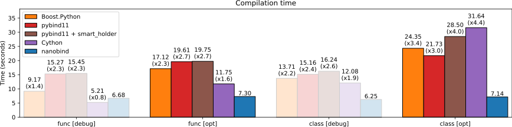
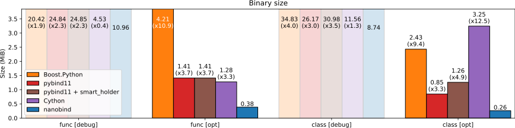
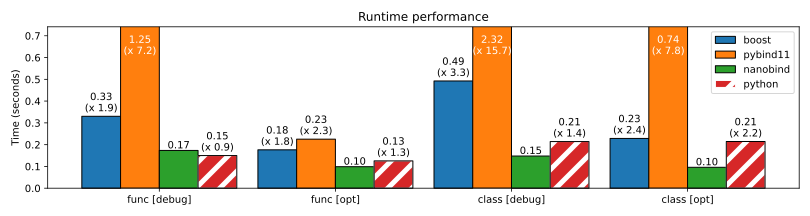

.. _benchmarks:

Benchmarks
==========

.. note:: 

   **TL;DR**: nanobind bindings compile **~2-3× faster**, produce **~3×
   smaller** binaries, and have up to **~8× lower** runtime overheads compared
   to pybind11.

The following experiments analyze the performance of a large
function-heavy (``func``) and class-heavy (``class``) binding microbenchmark
compiled using `Boost.Python <https://github.com/boostorg/python>`_,
`pybind11 <https://github.com/pybind/pybind11>`_, and nanobind in both
``debug`` and size-optimized (``opt``) modes. A comparison with `cppyy
<https://cppyy.readthedocs.io/en/latest/>`_, which uses dynamic compilation,
is also shown later. Details on the experimental setup can be found
:ref:`below <benchmark_details>`.

Compilation time
----------------

The first plot contrasts the compilation time, where “*number* ×”
annotations denote the amount of time spent relative to nanobind. As
shown below, nanobind achieves a consistent ~\ **2-3× improvement**
compared to pybind11.

Binary size
-----------

nanobind also greatly reduces the binary size of the compiled bindings.
There is a roughly **3× improvement** compared to pybind11 and a **8-9×
improvement** compared to Boost.Python (both with size optimizations).

Performance
-----------

The last experiment compares the runtime performance overheads by calling a
bound function many times in a loop. Here, it is also interesting to compare
against `cppyy <https://cppyy.readthedocs.io/en/latest/>`__ (gray bar) and a
pure Python implementation that runs bytecode without binding overheads
(hatched red bar).

This data shows that the overhead of calling a nanobind function is
lower than that of an equivalent function call done within CPython. The
functions benchmarked here don’t perform CPU-intensive work, so this
this mainly measures the overheads of performing a function call,
boxing/unboxing arguments and return values, etc.

The difference to pybind11 is **significant**: a ~\ **2× improvement**
for simple functions, and an **~8× improvement** when classes are being
passed around. Complexities in pybind11 related to overload
resolution, multiple inheritance, and holders are the main reasons for
this difference. Those features were either simplified or completely
removed in nanobind.

Finally, there is a **~1.4× improvement** in both experiments compared
to cppyy (please ignore the two ``[debug]`` columns—I did not feel
comfortable adjusting the JIT compilation flags; all cppyy bindings
are therefore optimized.)

Discussion
----------

Performance improvements compared to pybind11 are the result of optimizations
discussed in the :ref:`previous section <perf_improvements>`.

`cppyy <https://cppyy.readthedocs.io/en/latest/>`_ also achieves excellent
performance in the comparison above. It is based on dynamic parsing of C++ code
and *just-in-time* (JIT) compilation of bindings via the LLVM compiler
infrastructure. The authors of cppyy report that their tool produces bindings
with much lower overheads compared to pybind11, and the above plots show that
this is indeed true.

While nanobind retakes the performance lead, there are other qualitative
factors make these two tools appropriate to different audiences: cppyy has its
origin in CERN's ROOT mega-project and must be highly dynamic to work with that
codebase: it can parse header files to generate bindings as needed. cppyy works
particularly well together with PyPy and can avoid boxing/unboxing overheads
with this combination. The main downside of cppyy is that it depends on
Cling/Clang/LLVM that must be deployed on the user's side and then run there.
There isn't a way of pre-generating bindings and then shipping just the output
of this process.

nanobind is relatively static in comparison: you must tell it which functions
to expose via binding declarations. These declarations offer a high degree of
flexibility that users will typically use to create bindings that feel
*pythonic*. At compile-time, those declarations turn into a sequence of CPython
API calls, which produces self-contained bindings that are easy to redistribute
via `PyPI <https://pypi.org>`_ or elsewhere. Tools like `cibuildwheel
<https://cibuildwheel.readthedocs.io/en/stable/>`_ and `scikit-build
<https://scikit-build.readthedocs.io/en/latest/index.html>`_ can fully automate
the process of generating *Python wheels* for each target platform. A `minimal
example project <https://github.com/wjakob/nanobind_example>`_ shows how to do
this automatically via `GitHub Actions <https://github.com/features/actions>`_.

.. _benchmark_details:

Details
-------

The microbenchmark wraps a *large* number of trivial functions that only
perform a few additions. The objective of this is to quantify the overhead of
bindings on compilation time, binary size, and runtime performance. The
function-heavy benchmark (``func_*``) consists of 720 declarations of the form
(with permuted integer types)

.. code-block:: cpp

   m.def("test_0050",  {
       return a+b+c+d+e+f;
   });

while the latter (``class_*``) does exactly the same computation but packaged
up in ``struct``\ s with bindings.

.. code-block:: cpp

   struct Struct50 {
       uint16_t a; int64_t b; int32_t c; uint64_t d; uint32_t e; float f;
       Struct50(uint16_t a, int64_t b, int32_t c, uint64_t d, uint32_t e, float f)
           : a(a), b(b), c(c), d(d), e(e), f(f) { }
       float sum() const { return a+b+c+d+e+f; }
   };

   py::class_<Struct50>(m, "Struct50")
       .def(py::init<uint16_t, int64_t, int32_t, uint64_t, uint32_t, float>())
       .def("sum", &Struct50::sum);

Each benchmark is compiled in debug mode (``debug``) and with optimizations
(``opt``) that minimize size (i.e., ``-Os``) and run on Python 3.9.10.
Compilation is done by AppleClang using consistent flags for all three binding
tools.

The code to generate the plots shown above is available `here
<https://github.com/wjakob/nanobind/blob/master/docs/microbenchmark.ipynb>`_.
